Milton Road Traffic Study 2019
==============================

This study compares journey times for buses with journey times for
general traffic on Milton Road in Cambridge. It looks at in-bound
traffic during the morning peak (07:30 to 09:30) between the junction
with the A14 and the junction with Arbury Road and Union Lane. It is
based on traffic statistics for November 2018 to October 2019.

Journey times vary widely, making them difficult to summarise. The
majority of the attached graphs use a 'box and whisker' representation
in which the green line is the median (or 50th percentile), the box
represents the range from the 25th to the 75th percentile (50% of all
readings), and the whiskers the range from the 5th to the 95th
percentile (90% of all journeys). The black circles show the remaining
10% of journeys.

The software used to compile this report is available on GitHub at
https://github.com/SmartCambridge/milton_road_study

Data
====

Data for this study comes from two sources:

Bus journey times
-----------------

Bus journey times are from the [SmartCambridge data
platform](https://smartcambridge.org/) which extracts them from
real-time bus position information to measure traffic speeds in
Cambridge. Journey times are extracted for buses travelling through
'Zones' enclosing sections of road. For this study a custom zone
'milton_road_alternate_in' was defined for the section of Milton Road
between its junction with the A14 and its junction with Arbury Road and
Union Lane and individual journey times were extracted for it. The mean
distance travelled by buses in this zone including was 2254 meters.

For comparability for other data, bus journey times are aggregated to
give median journey times for 15 minute periods from 07:30 to 09:30.
This yielded 1833 samples with at least one journey out of a theoretical
maximum of about 2080 (52 weeks, 5 days per week, 8 samples per day),
containing a median of 2 journeys each with a range of 1 to 5. Only the
Milton Road Park & Ride service travels through this zone from start to
end. While other buses use this section of Milton Road they don't travel
along its entire length.

The inbound Park and Ride service turns off Milton Road briefly to
service a stop at the Science Park. The time taken for this diversion is
included in the data analysed here:

General traffic journey Times
-----------------------------

Journey times for general traffic are from a real time data platform
provided to the County Council by [Drakewell
Ltd](https://www.drakewell.com/). This uses information broadcast by
BlueTooth devices (mainly mobile phones) to measure journey times
between monitoring stations. There are about 40 such stations at major
junctions in Cambridge. This study used data on traffic flow bwteeen stations
at the A14, at the junction with Kings Hedges Road and
at the junction with Milton Road and Union Lane):

This study used archive data provided by Drakewell that gives median
journey times and a count of observed journeys for 15 minute intervals
on links between pairs of stations. For the purposes of this study
the journey times on the two links were added to give total journey
times covering a total distance of 2186 meters. Samples with less than
10 journeys on either link were omitted, leaving a total of 1776 samples
out of the theoretical maximum of about 2080, containing a median of 42
observed journeys with a range of 20 to 94.

The Drakewell data is sensitive to various configuration parameters
which are changed from time to time. Overall the samples contain a
median of 42 samples each (inter-quartile range 33 to 50), but there was
a noticeable drop in sample size in July 2019, from a median of about 45
to about 30, probably as a result of the 'outlier sensitivity removal'
parameter being increased to its maximum value. This does not appear to
have had much is any effect on the overall journey times reported.

Observations and conclusions
============================

1. Bus and general traffic journeys typically take about the same amount
of time with a median of about 6 minutes with an interquartile range
from about 4.4 to 7.5 minutes. Buses have access to a bus lane for about
a third of the route between the junction with Fraser Road and the junction
with Arbury Road and Union Lane which should give them an advantage over
general traffic, but this may be balanced by calling at the Science
Park which involves navigating two cycles of the Science Park traffic lights.

2. Both bus and general traffic journeys exhibit a long tail with a similar
shape. While rare, all 'worst case' journey times can easily be double the
median time, sometimes more.

2. All journey times vary a little by time of day, day of week or month, but
only by about a minute.

Graphs
======

All of these graphs come in pairs, with each pair showing bus data first and
general traffic data second.

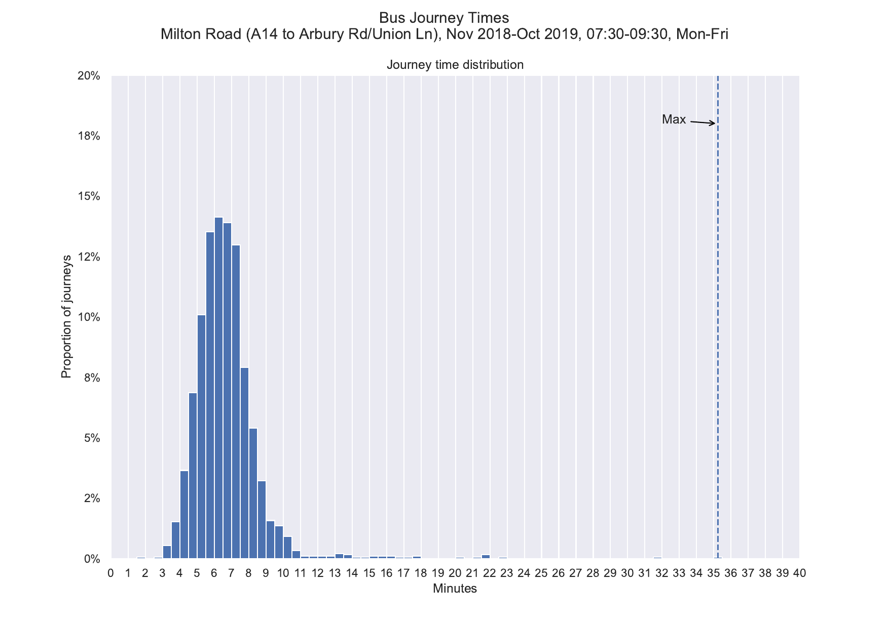
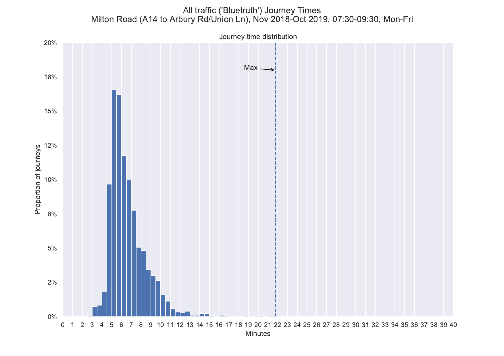
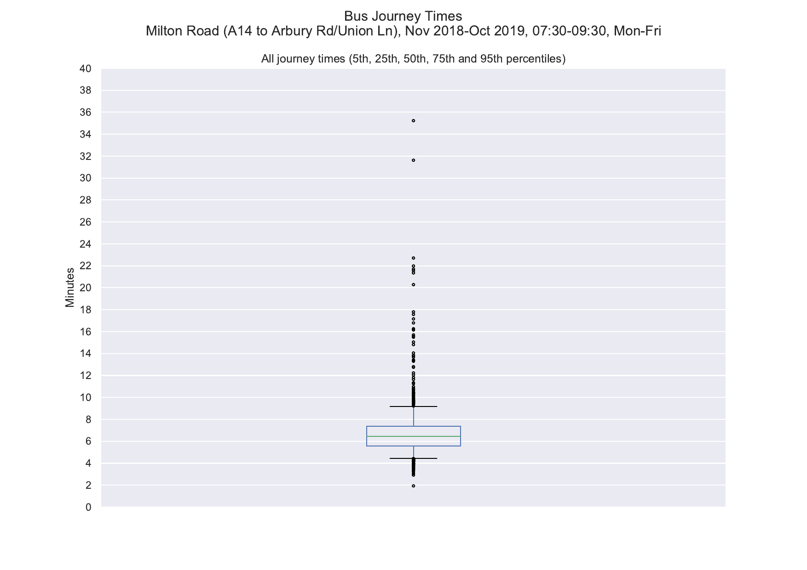
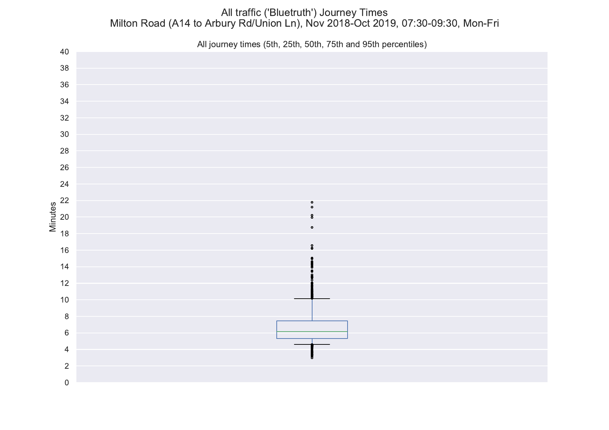
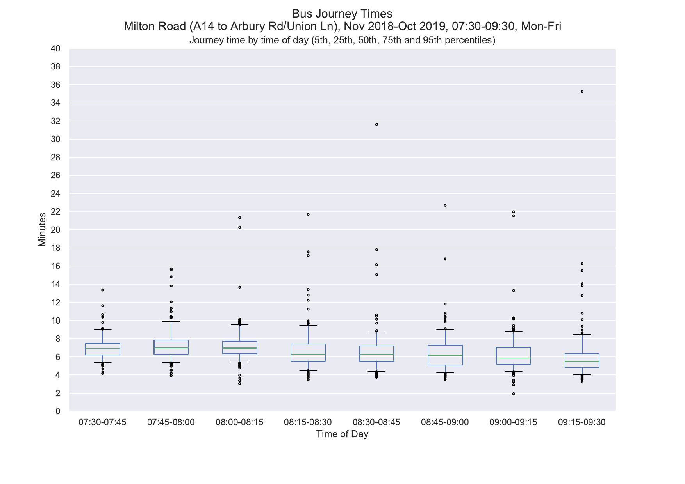
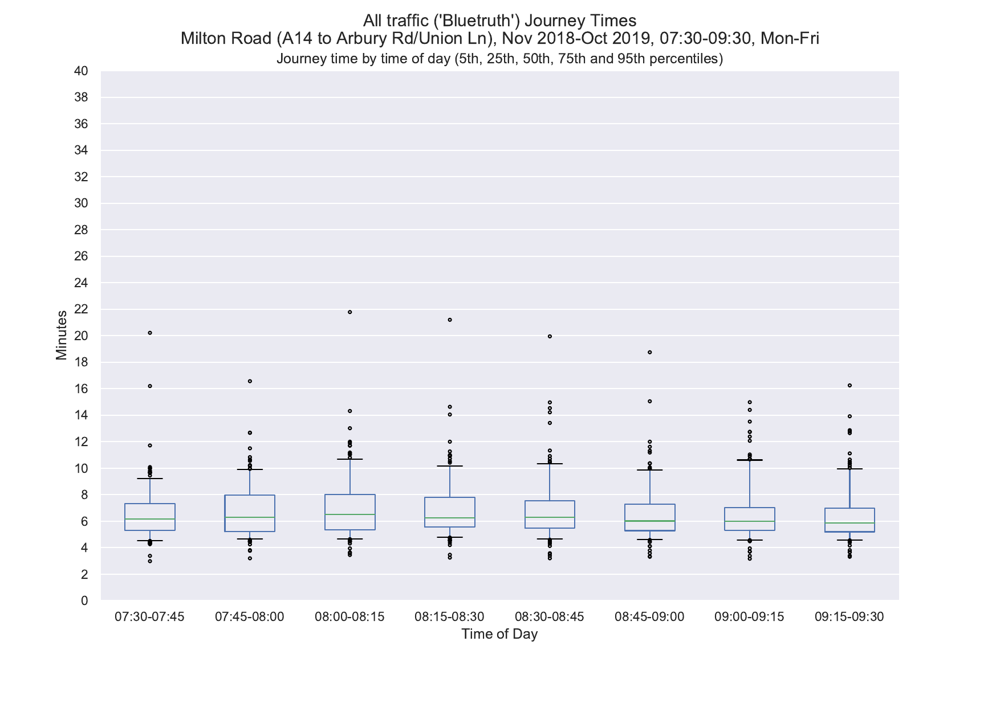
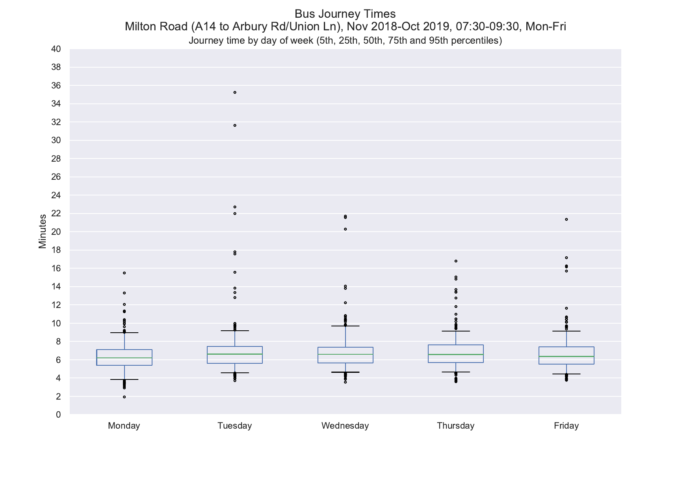
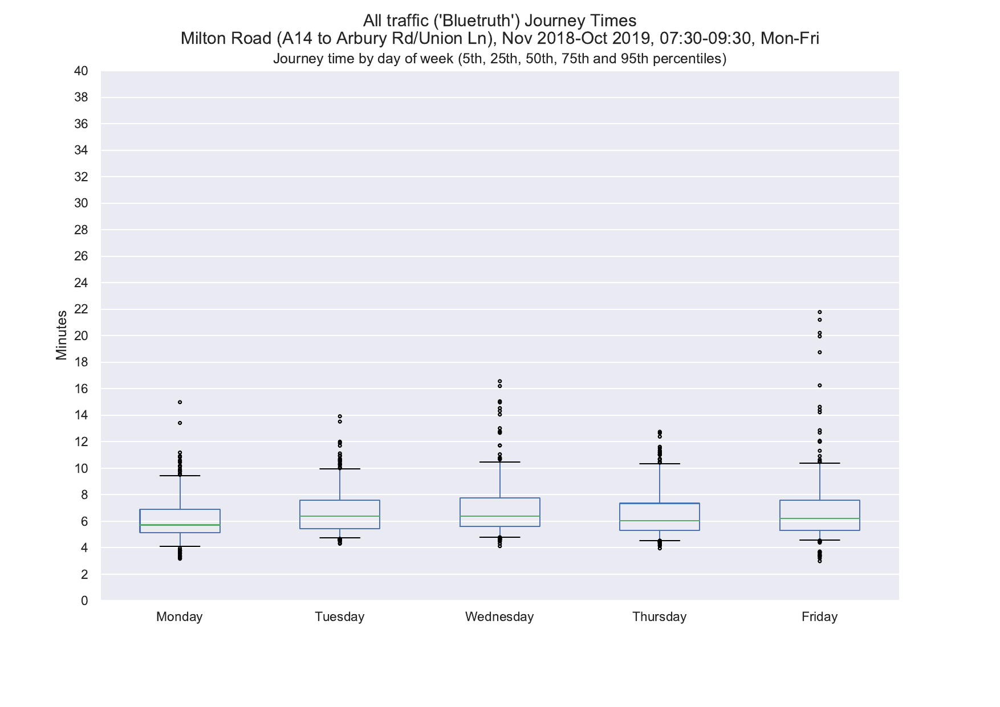
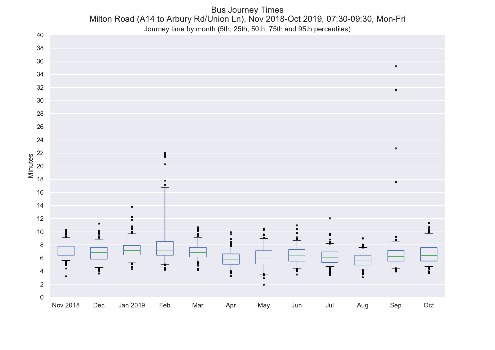
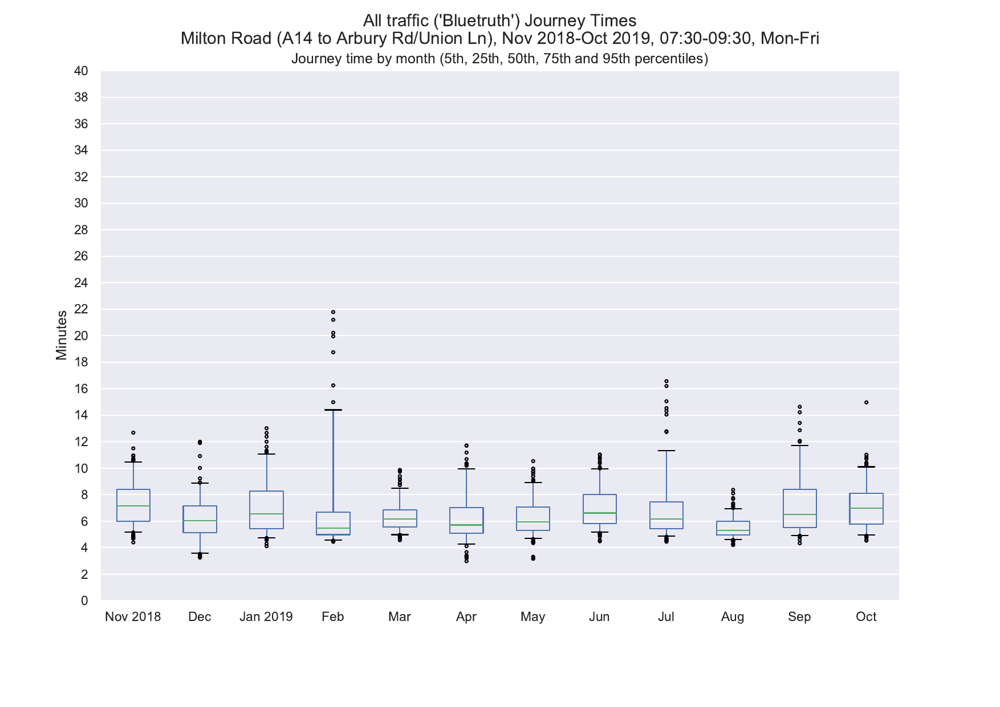
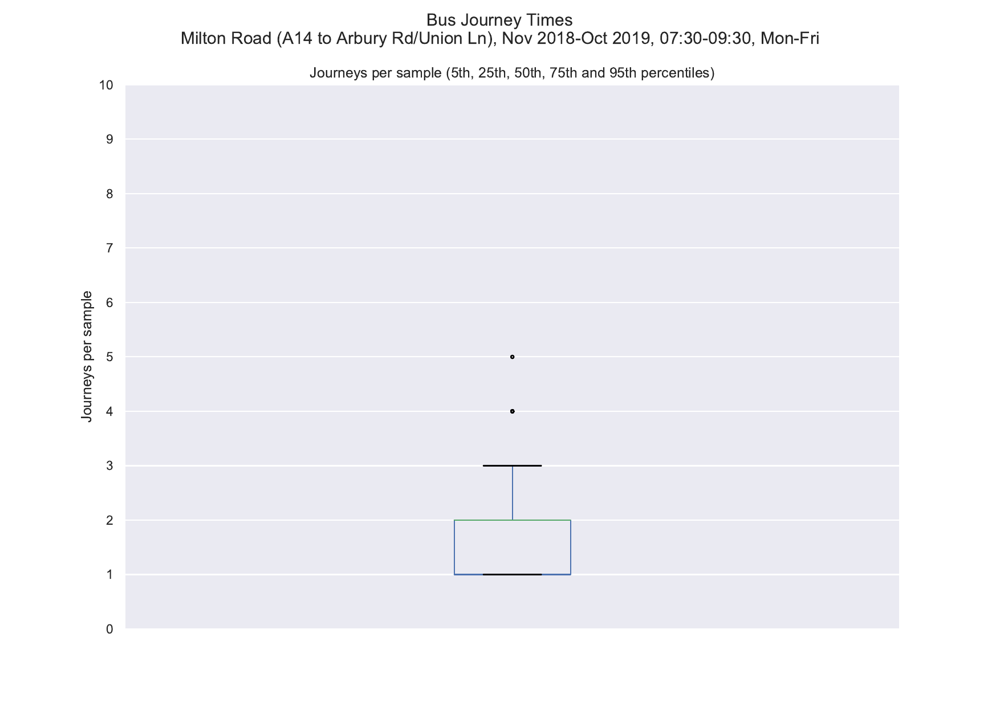
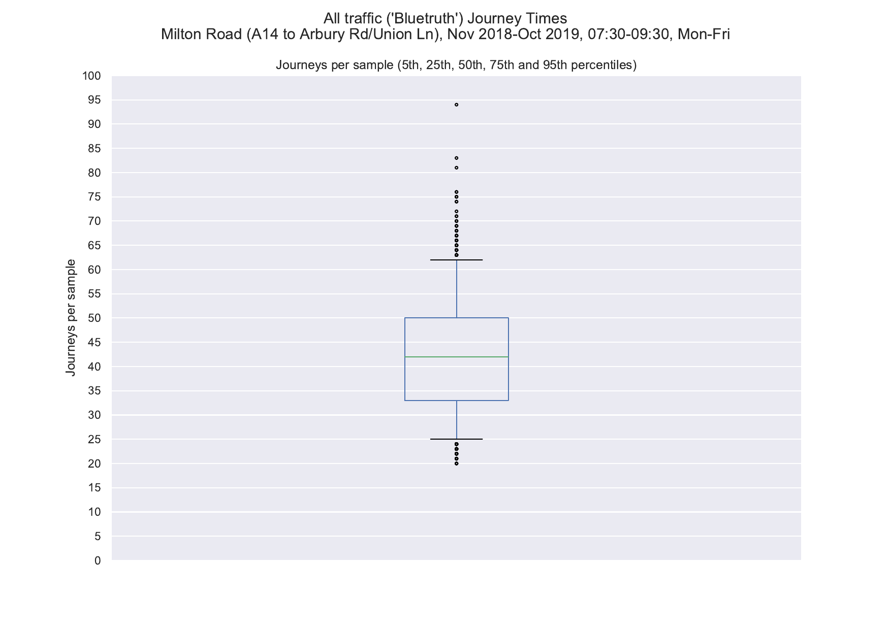

