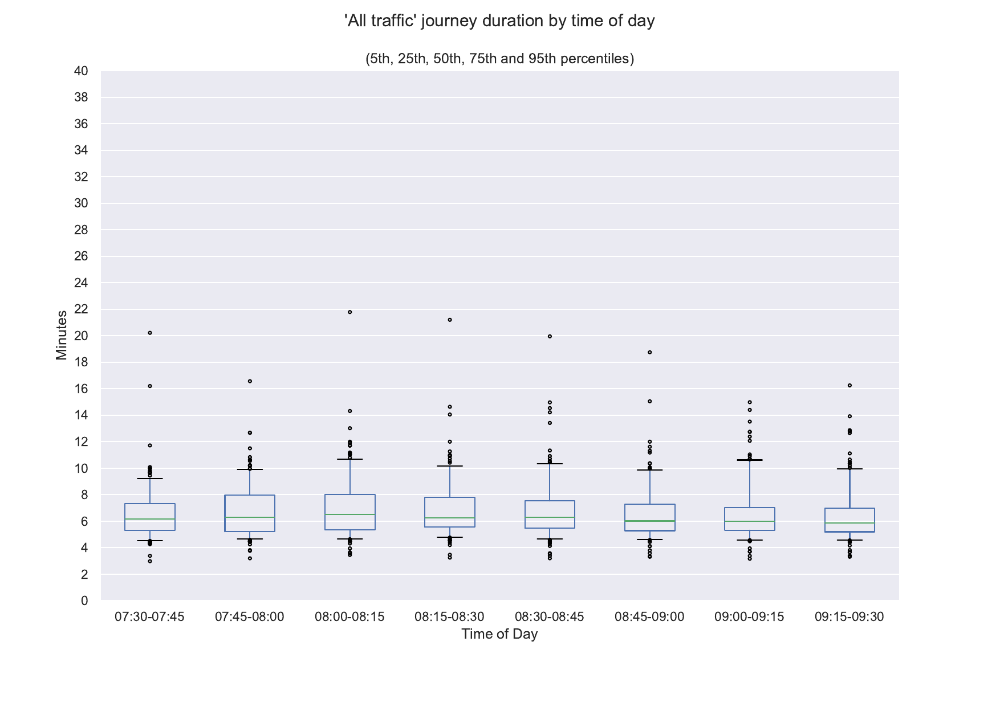
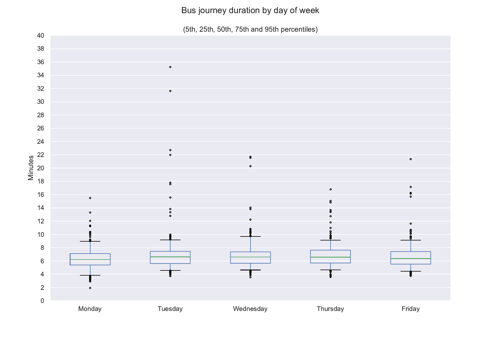
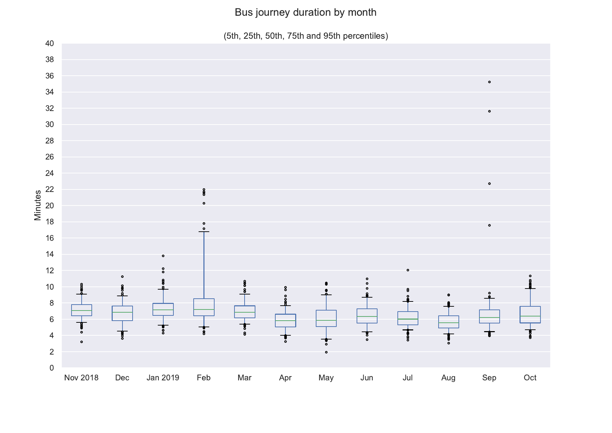

Milton Road Traffic Study 2019
==============================

Introduction
============

This study compares journey times for buses with journey times for
general traffic on Milton Road in Cambridge. It looks at in-bound
traffic during the morning peak (07:30 to 09:30 Monday to Friday)
between the junction with the A14 and the junction with Arbury Road and
Union Lane. It is based on measurements between November 2018 and
October 2019.

Journey times vary widely and are difficult to summarise. The
majority of the attached graphs use a 'box and whisker' representation
in which the green line is the median (or 50th percentile), the box
represents the range from the 25th to the 75th percentile (50% of all
readings), and the whiskers the range from the 5th to the 95th
percentile (90% of all readings). The black circles show the remaining
10% of readings.

The software used to compile this report has been open sourced and is
available on GitHub at
https://github.com/SmartCambridge/milton_road_study

This report was prepared by Jon Warbrick in the University of Cambridge
Department of Computer Science and Technology.

Data
====

Data for this study comes from two sources:

1. Bus journey times, derived from bus position data
2. General traffic journey times, derived from Bluetooth sensors

Bus journey times
-----------------

Bus journey times are from the [SmartCambridge Inteleget City
Platform](https://smartcambridge.org/) which extracts bus journey times
from real-time bus position information to measure traffic speeds in
Cambridge. Journey times are extracted for buses travelling through
'Zones' enclosing sections of road. For this study a custom zone
'milton_road_alternate_in' was defined for the section of Milton Road
between its junction with the A14 and its junction with Arbury Road and
Union Lane and individual journey times were extracted for it. The mean
distance travelled by buses in this zone was 2254 meters.

Bus journey times were aggregated to give median journey times for 15
minute periods from 07:30 to 09:30. This yielded 1833 samples with at
least one journey out of a theoretical maximum of about 2080 (52 weeks,
5 days per week, 8 samples per day), containing a median of 2 journeys
each with a range of 1 to 5. The Milton Road Park & Ride service is the
only one travelling through this zone from start to end. While other
buses use this section of Milton Road they don't travel along its entire
length.

The inbound Park and Ride service turns off Milton Road briefly to
service a stop at the Science Park until 09:15 which adds between one
and two minutes to the journey time in normal conditions. The time
taken for this diversion is included in the data analysed here:

General traffic journey Times
-----------------------------

Journey times for general traffic are from a real time data platform
provided to the County Council by [Drakewell
Ltd](https://www.drakewell.com/). This uses detection of BlueTooth
devices (mainly mobile phones) to measure journey times between
monitoring stations. There are about 40 such stations at major junctions
in Cambridge. This study used data on traffic flow between stations at
the A14 ('A'), at the junction with Kings Hedges Road ('B') and at the
junction with Milton Road and Union Lane ('C'):

This study used archive data provided by Drakewell that gives median
journey times and a count of observed journeys for 15 minute intervals
on links between pairs of stations. For the purposes of this study the
journey times on the two links (A to B, B to C) were added to give
journey times covering a total distance of 2186 meters. Samples with
less than 10 journeys on either link were omitted, leaving a total of
1776 samples out of the theoretical maximum of about 2080, containing a
median of 42 observed journeys with a range of 20 to 94. By comparison,
data from an intelligent traffic sensor located on Milton Road just past
the Arbury Road/Union Lane junction records a median of 137 motor
vehicles passing it during the same time intervals (inter-quartile range
126 to 146).

The Drakewell data is sensitive to various configuration parameters
which are changed from time to time. Overall the samples contain a
median of 42 samples each (inter-quartile range 33 to 50), but there was
a noticeable drop in sample size in July 2019, from a median of about 45
to about 30, probably as a result of the 'outlier sensitivity removal'
parameter being increased to its maximum value. This does not appear to
have had any effect on the overall journey times reported.

Observations and conclusions
============================

1. Within this sample, buses are typically about 20 seconds (5%) slower
than the general traffic (median bus journey time 388 seconds compared
to 368 seconds for general traffic). Buses have access to a bus lane for
about a third of the route (between the junction with Fraser Road and
the junction with Arbury Road and Union Lane) which should give them an
advantage over general traffic, but this may be balanced by calling at
the Science Park.

2. Times for bus journeys are slightly more consistent that for general
traffic journeys (with an inter-quartile range of 88 seconds, compared
to 128 seconds for general traffic). General traffic journey times also
have a larger 'tail' of longer journeys.

3. Bus times are noticeably slower between 07:30 and 08:15 and
noticeably faster between 09:15 and 09:30 (probably because they are no
longer diverting to the Science Park stop). General traffic journey
times are fairly consistent over the entire period.

4. All journey times vary slightly Monday to Friday with quicker
journeys on Mondays and Fridays and slower ones on Wednesdays. This
matches trends observed elsewhere in traffic volumes and car park usage.

5. All journey times vary a little month to month. Lower times in April
and August probably correspond to school holidays.

Graphs
======

All of these graphs come in pairs, with each pair showing bus data first and
general traffic data second.

